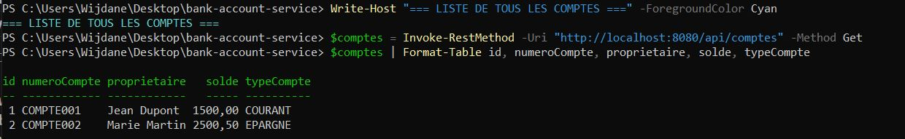
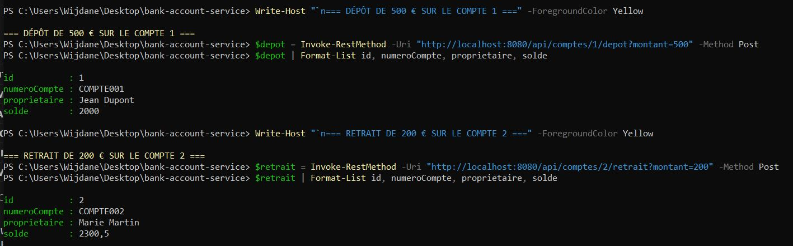
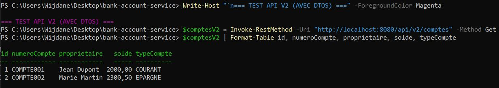

# 🏦 Bank Account Microservice

Un microservice Spring Boot complet pour la gestion de comptes bancaires avec APIs REST, GraphQL et documentation Swagger.

## 📸 Démonstrations

### Création de Comptes

*Création de comptes bancaires via API REST*

### Liste des Comptes

*Affichage de tous les comptes créés*

### Transactions Bancaires

*Opérations de dépôt et retrait sur les comptes*

### Interface Swagger

*Documentation interactive des APIs avec Swagger*

### Console H2 Database

*Interface d'administration de la base de données*

### API GraphQL

*Tests des requêtes GraphQL flexibles*

### Spring Data REST

*API REST automatique avec hypermédia*

### API Version 2

*Version améliorée avec DTOs et Mappers*

## 🚀 Fonctionnalités

- ✅ **API REST complète** - CRUD + opérations bancaires (dépôt/retrait)
- ✅ **API GraphQL** - Requêtes flexibles
- ✅ **Spring Data REST** - API REST automatique
- ✅ **Documentation Swagger** - Interface interactive
- ✅ **Base de données H2** - Développement
- ✅ **Tests complets** - Unitaires et d'intégration
- ✅ **DTOs & Mappers** - Architecture propre
- ✅ **Multi-versions d'API** - v1 et v2

## 🛠️ Technologies

- **Java 17**
- **Spring Boot 3.2**
- **Spring Data JPA**
- **Spring GraphQL**
- **H2 Database** (Développement)
- **Lombok**
- **MapStruct**
- **SpringDoc OpenAPI**
- **JUnit 5**

## 📦 Installation

```bash
# Cloner le projet
git clone https://github.com/votre-username/bank-account-service.git
cd bank-account-service

# Builder l'application
mvn clean package

# Lancer l'application
mvn spring-boot:run
```

## 🌐 URLs d'accès

Une fois l'application démarrée, accédez aux interfaces :

| Service | URL | Description |
|---------|-----|-------------|
| 🏠 Application | http://localhost:8080 | Page d'accueil |
| 📚 Swagger UI | http://localhost:8080/swagger-ui.html | Documentation APIs |
| 🗄️ H2 Console | http://localhost:8080/h2-console | Base de données |
| 🔄 GraphQL | http://localhost:8080/graphql | Endpoint GraphQL |
| 🔌 REST Data | http://localhost:8080/api/rest/comptes | Spring Data REST |

**H2 Console :**
- URL: `jdbc:h2:mem:testdb`
- User: `sa`
- Password: _(laisser vide)_

## 🎮 Utilisation des APIs

### 🔷 API REST v1 (`/api/comptes`)

#### Créer un compte
```bash
POST http://localhost:8080/api/comptes
Content-Type: application/json

{
  "numeroCompte": "COMPTE001",
  "proprietaire": "Jean Dupont",
  "solde": 1500.00,
  "typeCompte": "COURANT"
}
```

#### Lister tous les comptes
```bash
GET http://localhost:8080/api/comptes
```

#### Faire un dépôt
```bash
POST http://localhost:8080/api/comptes/1/depot?montant=500
```

#### Faire un retrait
```bash
POST http://localhost:8080/api/comptes/1/retrait?montant=200
```

### 🔷 API REST v2 (`/api/v2/comptes`)
Version avec DTOs et Mappers :
```bash
GET http://localhost:8080/api/v2/comptes
POST http://localhost:8080/api/v2/comptes
```

### 🔷 API GraphQL

#### Lister les comptes
```graphql
query {
  comptes {
    id
    numeroCompte
    proprietaire
    solde
    typeCompte
  }
}
```

#### Récupérer un compte
```graphql
query {
  compte(id: 1) {
    id
    numeroCompte
    proprietaire
    solde
  }
}
```

## 🧪 Tests

```bash
# Lancer tous les tests
mvn test

# Tests avec rapport de couverture
mvn clean test jacoco:report
```

## 📁 Structure du Projet

```
bank-account-service/
├── src/main/java/com/example/bankaccount/
│   ├── entity/Compte.java              # Entité JPA
│   ├── repository/CompteRepository.java # Repository Spring Data
│   ├── service/CompteService.java      # Couche métier
│   ├── controller/                     # Contrôleurs
│   │   ├── CompteController.java       # API REST v1
│   │   ├── CompteControllerV2.java     # API REST v2
│   │   └── CompteGraphQLController.java # GraphQL
│   ├── dto/CompteDTO.java              # Data Transfer Objects
│   ├── mapper/CompteMapper.java        # Mappers MapStruct
│   └── config/SwaggerConfig.java       # Configuration Swagger
├── src/test/java/                      # Tests complets
├── Documentation/images/               # Captures d'écran
└── pom.xml                            # Configuration Maven
```

## 📝 API Endpoints

### REST API v1
- `GET /api/comptes` - Lister tous les comptes
- `GET /api/comptes/{id}` - Récupérer un compte
- `POST /api/comptes` - Créer un compte
- `PUT /api/comptes/{id}` - Modifier un compte
- `DELETE /api/comptes/{id}` - Supprimer un compte
- `POST /api/comptes/{id}/depot` - Faire un dépôt
- `POST /api/comptes/{id}/retrait` - Faire un retrait

### REST API v2
- `GET /api/v2/comptes` - Lister avec DTOs
- `POST /api/v2/comptes` - Créer avec DTOs

### GraphQL
- `query { comptes }` - Lister
- `query { compte(id) }` - Récupérer

## 🚀 Déploiement

### Heroku
```bash
# Créer l'application
heroku create bank-account-service

# Ajouter PostgreSQL
heroku addons:create heroku-postgresql:mini

# Déployer
git push heroku main
```

### Render.com
1. Connectez votre GitHub à [Render.com](https://render.com)
2. Créez un "Web Service"
3. Sélectionnez ce repository
4. Configuration :
   - **Build Command** : `mvn clean package -DskipTests`
   - **Start Command** : `java -jar target/bank-account-service-1.0.0.jar`

## 🔧 Développement

### Prérequis
- Java 17
- Maven 3.6+

### Commandes utiles
```bash
# Compiler
mvn clean compile

# Lancer l'application
mvn spring-boot:run

# Package pour production
mvn clean package -DskipTests
```

## 🤝 Contribution

1. Forkez le projet
2. Créez une branche feature (`git checkout -b feature/AmazingFeature`)
3. Commitez vos changements (`git commit -m 'Add AmazingFeature'`)
4. Poussez la branche (`git push origin feature/AmazingFeature`)
5. Ouvrez une Pull Request

## 📄 License

Ce projet est sous licence MIT - voir le fichier [LICENSE](LICENSE) pour plus de détails.

---

**⭐ N'oubliez pas de donner une étoile si ce projet vous a été utile !**